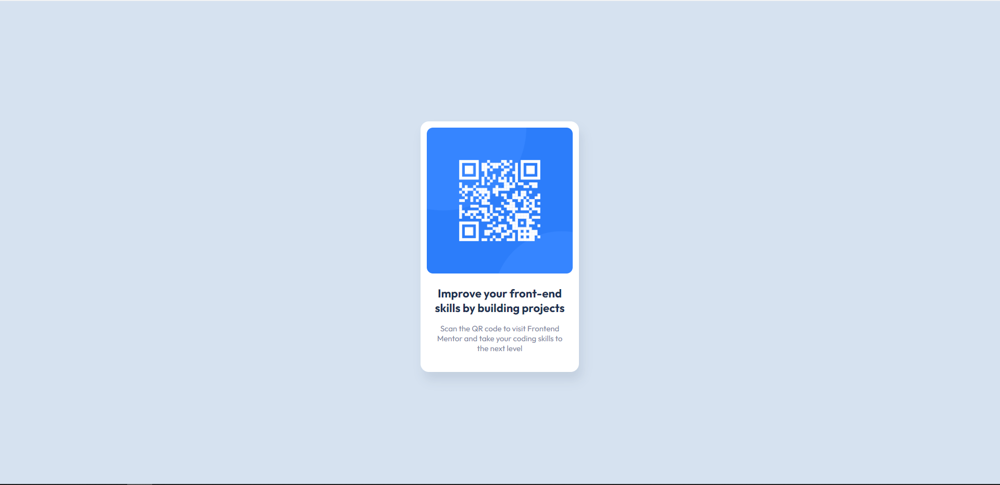

# Frontend Mentor - QR code component solution

This is a solution to the [QR code component challenge on Frontend Mentor](https://www.frontendmentor.io/challenges/qr-code-component-iux_sIO_H).

## Table of contents

- [Overview](#overview)
  - [Screenshot](#screenshot)
  - [Links](#links)
- [My process](#my-process)
  - [Built with](#built-with)
  - [What I learned](#what-i-learned)
- [Author](#author)

## Overview

Building a QR code component using the provided design file, for desktop and mobile view.

### Screenshot

### Links

- Solution URL: [Add solution URL here](https://github.com/Antonvasilache/qr-code)
- Live Site URL: [Add live site URL here](https://qr-code-component-av.netlify.app/)

## My process

1. I wrote down the html elements in order and added the content.
2. Added everything into a flex container.
3. Resized the elements to have a better view of the page.
4. Centered the container to the viewport.
5. Added padding and border radius to match the design file.
6. Added fonts and colors.
7. Adjusted margins to match the spacing in the design.
8. Added shadows.
9. Added additional padding to the container wrapper to center the component for mobile view at 320px.

### Built with

- Semantic HTML5 markup
- CSS custom properties
- Flexbox

### What I learned

In building this component, I learned about how to center the content to the screen using the vh unit of measure. The main challenge that I encountered was removing the lateral scroll, while maininting the content alignment to center. This took some trial and error with flexbox and grid, and eventually setting the height to 90vh on the container wrapper.

## Author

- Website - [Antonvasilache.com](https://www.antonvasilache.com)
- Frontend Mentor - [@Antonvasilache](https://www.frontendmentor.io/profile/Antonvasilache)
